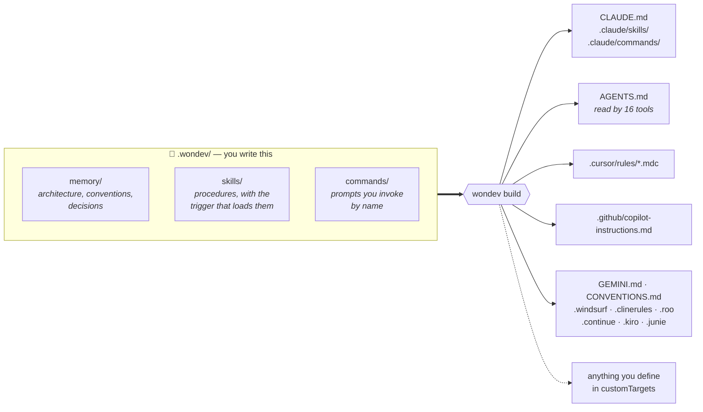

<div align="center">

<picture>
  <source media="(prefers-color-scheme: dark)" srcset="assets/hero-dark.svg">
  <source media="(prefers-color-scheme: light)" srcset="assets/hero-light.svg">
  
</picture>

# wondev

**Write your AI agent knowledge once. Compile it for every agent.**

[](https://github.com/wondping0/wondev/actions/workflows/ci.yml)
[](https://www.npmjs.com/package/wondev)
[](https://nodejs.org)
[](LICENSE)

[Website](https://wondping0.github.io/wondev/) ·
[Changelog](CHANGELOG.md) ·
[Security](docs/security.md) ·
[Contributing](CONTRIBUTING.md)

</div>

```bash
npx wondev init
```

## The problem

A repository worked on by AI agents ends up with one config file per tool:

```
CLAUDE.md
AGENTS.md
.cursor/rules/
.github/copilot-instructions.md
GEMINI.md
...
```

They say overlapping things. They drift apart. Nobody updates all of them.

## What wondev does

You write agent knowledge once, in `.wondev/`. `wondev build` compiles it into the native
format of every agent your team uses. `wondev check` fails CI when they drift.

TypeScript compiles to JavaScript. wondev compiles to agent config.



> [!NOTE]
> Everything on the right is **generated**. You never edit it. `wondev check` fails your CI
> if someone does.

## Quick start

```bash
npx wondev init          # scaffold .wondev/ with a starter pack, then build
npx wondev check         # validate and detect drift
```

`init` writes six ready-to-use skills — `debugging`, `writing-tests`, `code-review`,
`planning-work`, `git-workflow`, `verify-before-done` — plus memory scaffolds for
architecture, conventions, glossary, and decision records. Edit them; they are yours.

## Commands

| Command | What it does |
| ------- | ------------ |
| `wondev init` | Scaffold `.wondev/` with the starter pack, then build |
| `wondev adopt` | Read existing agent config back into `.wondev/` |
| `wondev build` | Compile to every enabled target |
| `wondev watch` | Rebuild whenever `.wondev/` changes |
| `wondev add <skill\|memory\|command\|agent> <name>` | Scaffold one new artifact |
| `wondev check` | Validate sources and detect drift — exits 1 on failure |
| `wondev clean` | Remove generated files, per the manifest |
| `wondev migrate` | Bring an older `.wondev/` up to the current source schema |
| `wondev upgrade` | Update starter-pack files, never touching ones you edited |
| `wondev doctor` | Diagnose the project and report problems |
| `wondev targets` | List known targets and what reads them (`--new` for recent additions) |

Useful flags: `--targets a,b,c` and `--all` on `init`; `--dry-run`, `--force`, and
`--target <name>` on `build`; `--cwd <dir>` and `--no-color` everywhere.

## The three artifact types

**Memory** — durable project facts. Architecture, conventions, glossary, decision records.

`always: true` is the load-bearing flag. Documents marked always-on are **copied into** the
flattened targets an agent reads on every turn. Everything else is **referenced**: one line
carrying its path, its estimated token cost, and its `description` as the trigger, so the
agent opens it only when the trigger matches.

That distinction is the whole point. On a 22-note vault where nothing was marked always-on,
inlining everything produced a 66k-token `AGENTS.md`; referencing brought it to 10.7k, and
`CLAUDE.md` from 56k to 0.6k. Mark a document `always: true` only if it is worth paying for
in every single request.

> [!TIP]
> The highest-value thing to write down is what you **tried and rejected**. It is the one
> thing an agent cannot infer from reading the code, and it stops the same bad idea coming
> back every few weeks.

```markdown
---
title: Architecture
always: true
---
Handlers live in `src/routes/` and never contain business logic.
```

**Skills** — procedures. The `description` is the *trigger*: it is what an agent matches
against when deciding whether to load the skill.

```markdown
---
name: debugging
description: Use when investigating a bug or failing test, before proposing a fix
---
1. Reproduce it. 2. Read the actual error. ...
```

**Commands** — repeatable prompts a person invokes by name, like `/review`.

**Agents** — subagents that run with their own context window. As with skills, the
`description` is the *dispatch rule*: it is what the calling agent matches against when
deciding whether to hand a task off.

```markdown
---
name: blast-radius
description: Delegate when a change touches more than three services
tools: [Read, Grep]
model: sonnet
---
1. Map which services the change reaches. 2. Report those with no test covering the path.
```

Claude Code gets real files in `.claude/agents/`. Every other target gets a listing — name,
dispatch rule, and path — because delegation is a host feature, and a host that lacks it
cannot act on the body anyway.

### Reference material a skill does not carry

Any `.md` file beside `SKILL.md` becomes an attachment:

```
.wondev/skills/graphify/
├── SKILL.md
└── references/
    ├── query.md
    └── rebuild.md
```

Claude Code gets the files copied across, where it loads them only when the skill points at
them. Flat targets like `AGENTS.md` get the *paths* instead — never the contents. That is
the point of keeping them separate: `AGENTS.md` already carries every skill body, and it is
read on every single turn, so material that is needed occasionally must not be paid for
constantly. The paths are real, so an agent that wants a reference can open it.

Attachments must be markdown. Anything else warns and is skipped, because every generated
file gets an HTML comment header that would corrupt other formats.

## The memory index

A dozen memory documents is a library; a dozen an agent loads indiscriminately is a bill.
The index gives it a way to choose — what each document costs, and when it is worth reading:

```yaml
# .wondev/wondev.yaml
index:
  file: docs/memory-index.md
  budget: 8000
```

```markdown
## Always loaded

| Note | ≈tok | Checked | When to read |
| ---- | ---- | ------- | ------------ |
| [[architecture]] | 0.6k | ✓ 2026-08-10 | |

**Always-on total: ≈0.6k** (budget 8.0k)

## On demand

| Note | ≈tok | Checked | When to read |
| ---- | ---- | ------- | ------------ |
| [[decisions/0001-single-process]] | 0.3k | | Asking why the architecture is shaped this way. |
```

The table is written into a **managed region**, so prose you put around it — how to use the
vault, house rules, anything else that belongs at the entry point — survives every build.
You never edit the table, so it can never fall out of date with the documents it describes.

`≈tok` is an estimate (four characters per token), meant for comparing documents rather than
for accounting.

**Freshness.** Two optional frontmatter fields record whether a document has been reconciled
with reality:

```markdown
---
title: Architecture
verified: 2026-08-10
verifiedAgainst: ports and arrows in docker-compose.yml
---
```

The date produces the ✓. `verifiedAgainst` is the part that matters to a reader deciding
whether to trust the numbers inside — "someone looked at this" and "someone checked it
against the compose file" are different claims. Documents with no `verified` are reported by
`check` as warnings, never errors.

**Budget.** Set `index.budget` and `wondev check` fails when always-on context exceeds it,
naming the largest contributors. There is deliberately **no default**: a default would fail
CI in every project that upgraded into it.

Unknown frontmatter keys are preserved and can be given their own index columns:

```yaml
index:
  file: docs/memory-index.md
  columns:
    - { key: owner, label: Owner }
```

They are never written into a target's own frontmatter — those files are parsed by other
people's tools.

## Already have agent config?

`wondev adopt` runs the compiler backwards. It reads `CLAUDE.md`, `AGENTS.md`, `GEMINI.md`,
`.github/copilot-instructions.md`, `CONVENTIONS.md`, and the whole `.claude/` tree —
skills with their attachments, commands, subagents — and writes `.wondev/` from them.

```bash
npx wondev adopt --dry-run                    # see the plan first
npx wondev adopt --vault docs/dev-guide       # also take a markdown directory in as memory
```

It is honest about being lossy. A skill trigger that was never written down cannot be read
back out, so adopt leaves it absent rather than inventing one — a wrong `description` is
worse than a missing one, because it is what an agent matches on.

Two things it does get right that are easy to get wrong. It takes only the hand-written part
of a file wondev previously generated, so adopting does not round-trip wondev's own output
back into the source. And `--vault` normalises human filenames — `Alur Live Map.md` becomes
`alur-live-map` — while rewriting the `[[wikilinks]]` between them, so a vault that was
internally consistent stays that way. Links pointing at things that were never notes are
reported up front, with counts, rather than surfacing as errors on your first build.

Nothing is deleted, and the files it adopted from stay where they are.

## A guide for people, from the same source

`.wondev/` describes the project to whoever maintains it, not only to agents. Enable the
`guide` target and wondev renders it as a single self-contained page:

```yaml
targets:
  - claude
  - guide          # writes GUIDE.html
```

Sidebar navigation, every artifact type, per-document token cost, and freshness stamps.
No scripts, no fonts, no stylesheet, no external requests of any kind — it opens from
`file://`, survives being emailed, and can be served read-only from a container.

Markdown is converted at build time by a small built-in renderer, so there is still no
runtime dependency beyond `yaml`. Fenced blocks stay fenced: a Mermaid diagram is shown as
labelled code rather than drawn, which is honest about what a dependency-free page can do.

## Supported agents

Run `wondev targets` for the current list.

<details open>
<summary><b>12 agents built in</b> — click to collapse</summary>
<br>

| Target | Output | Also read by |
| ------ | ------ | ------------ |
| `claude` | `CLAUDE.md`, `.claude/skills/`, `.claude/commands/` | Claude Code |
| `agents` | `AGENTS.md` | Codex, Cursor, Copilot, Gemini CLI, Aider, Windsurf, Zed, Jules, Factory, opencode, goose, Devin, Warp, RooCode, Kilo Code, Amp |
| `cursor` | `.cursor/rules/*.mdc` | Cursor (with native `globs` / `alwaysApply`) |
| `copilot` | `.github/copilot-instructions.md` | GitHub Copilot |
| `gemini` | `GEMINI.md` | Gemini CLI |
| `windsurf` | `.windsurf/rules/` | Windsurf |
| `cline` | `.clinerules/` | Cline |
| `roo` | `.roo/rules/` | Roo Code |
| `continue` | `.continue/rules/` | Continue |
| `kiro` | `.kiro/steering/` | Kiro |
| `aider` | `CONVENTIONS.md` | Aider |
| `junie` | `.junie/guidelines.md` | JetBrains Junie |

Aliases work too: `codex`, `zed`, `opencode`, `jules`, and others resolve to `agents`.

</details>

### Any agent, including ones that do not exist yet

A target is data, not code. Three engines cover the whole field, so adding an agent is a
config entry — no wondev release required:

```yaml
# .wondev/wondev.yaml
customTargets:
  my-inhouse-agent:
    engine: single-file        # one flattened markdown file
    path: .myagent/context.md

  my-rules-agent:
    engine: rule-dir           # one file per artifact
    path: .myagent/rules
    ext: .md
    frontmatter:
      description: description
      globs: globs
      always: alwaysApply
```

## It is safe to run in a real repository

> [!IMPORTANT]
> wondev never silently overwrites your work, and it cannot write or delete outside the
> project — even when the repository was authored by someone else.

- **A manifest** (`.wondev/.manifest.json`) records a hash of every span wondev owns.
- **Unknown files are never clobbered.** If `AGENTS.md` exists but wondev did not write it,
  build refuses and names the file.
- **Your edits are never clobbered.** If a generated file changed since wondev wrote it,
  build refuses. `--force` overrides.
- **Managed regions.** In shared files, wondev owns only the span between markers:

  ```markdown
  Your own notes stay here, untouched.

  <!-- wondev:start -->
  generated
  <!-- wondev:end -->
  ```

  Adopting an existing `AGENTS.md` appends the block and preserves every other byte.
- **`clean` removes exactly the manifest entries** — deleting files it created outright, and
  stripping only the region from files it shares.
- **Atomic writes**, so an interrupted build cannot leave a truncated file.

## In CI

```yaml
- run: npx wondev check
```

Fails the build when someone edits `CLAUDE.md` by hand or forgets to rebuild after changing
`.wondev/`.

## Upgrading wondev

`.wondev/wondev.yaml` and the manifest both carry a `schema` and the wondev version that
wrote them, so a release can tell what produced a project and act accordingly.

When wondev changes its output format, `check` says which version generated the files
instead of reporting a bare mismatch:

```
3 generated file(s) were produced by wondev 0.1.0, but you are running 0.2.0.
Run `wondev build` to regenerate them with this version, and commit the result.
```

If the source format itself changes, `wondev migrate` updates `.wondev/` in place. It is
never run automatically — it rewrites files you authored, so it waits to be asked.

### Updating the starter pack

`wondev upgrade` offers newer versions of the skills and memory scaffolds that `init`
created:

| Your file | What happens |
| --------- | ------------ |
| never edited | replaced with the new version |
| **you edited it** | **left alone**; the new version is written to `<name>.new` |
| you deleted it | stays deleted, unless `--restore` |
| new in this release | added, unless `--no-new` |

wondev deliberately does **not** attempt a three-way merge. Merging prose produces
plausible-looking corruption — two reasonable sentences interleaved into one that instructs
an agent to do something neither author intended — and conflict markers left inside a file
an agent reads as instructions are worse still. A `.new` file next to yours is unglamorous
and always correct.

Flags: `--dry-run`, `--only <path>`, `--restore`, `--no-new`.

Formats from a newer wondev are refused with a clear message rather than misread. See
[docs/versioning.md](docs/versioning.md) for the full contract; the short version is that
**any change to generated bytes is at minimum a MINOR release.**

## Security

wondev writes across your repository and deletes files it previously wrote, and it is
routinely run on freshly cloned repositories. So **everything under `.wondev/` is treated as
untrusted input** — including the manifest wondev wrote itself.

- No process execution, no `eval`, no postinstall script, no telemetry. The only network
  request is `wondev doctor --online`, and only with that flag.
- Output paths are checked twice: lexically, and again after resolving symlinks. A
  repository shipping `.claude -> ~/.ssh` passes a lexical check while every write lands
  outside the project; the second check stops that.
- A manifest containing a path outside the project is rejected outright rather than
  sanitised, because wondev never writes one — its presence means tampering.
- Writes are atomic (temp file plus rename), and replace a symlink rather than writing
  through it.

Full threat model and residual risks: [docs/security.md](docs/security.md).

## Performance

Measured on a project with 66 skills, 44 memory docs, and 22 commands compiling to 886
output files across 12 targets:

| Phase | Time |
| ----- | ---- |
| load `.wondev/` | 15ms |
| render all targets | 13ms |
| plan writes | 46ms |
| apply | 6ms |
| **total work** | **82ms** |

File I/O runs with bounded concurrency rather than one file at a time, and the flattened
document shared by every single-file target is built once per build rather than once per
target. Commands are loaded on demand, so `wondev --version` costs about 20ms above bare
Node startup.

## Design notes

Near-zero dependencies (`yaml` is the only runtime dep) — `node:util.parseArgs` instead of
commander, `node:fs.watch` instead of chokidar, hand-rolled ANSI instead of chalk. Fast
`npx` cold start and a small supply-chain surface.

Rendering is a pure function of the source tree, so builds are deterministic: Windows and
Linux produce byte-identical output.

Requires Node 20+. Works on Windows, macOS, and Linux.

## Documentation

| Document | What it covers |
| -------- | -------------- |
| [docs/security.md](docs/security.md) | Threat model, enforced boundaries, residual risks |
| [docs/versioning.md](docs/versioning.md) | What MAJOR, MINOR, and PATCH mean here |
| [docs/releasing.md](docs/releasing.md) | Cutting a release, and the schema-bump checklist |
| [docs/evolution-plan.md](docs/evolution-plan.md) | How updates and migrations are designed to work |
| [CONTRIBUTING.md](CONTRIBUTING.md) | Setup, adding an agent, the golden-output rule |

## Contributing

Adding an agent usually needs no code — one entry in `src/core/registry.ts`, with a link to
the documentation that confirms its config path. See [CONTRIBUTING.md](CONTRIBUTING.md).

Found something that reads, writes, or deletes outside the project root? Report it privately
via [security advisories](https://github.com/wondping0/wondev/security/advisories/new)
rather than a public issue. See [SECURITY.md](SECURITY.md).

## License

MIT © [wondping0](https://github.com/wondping0)
